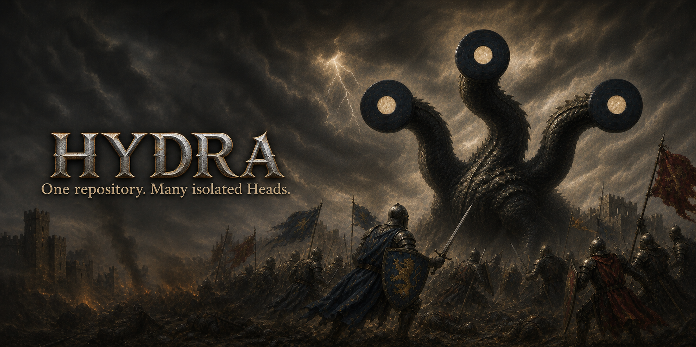
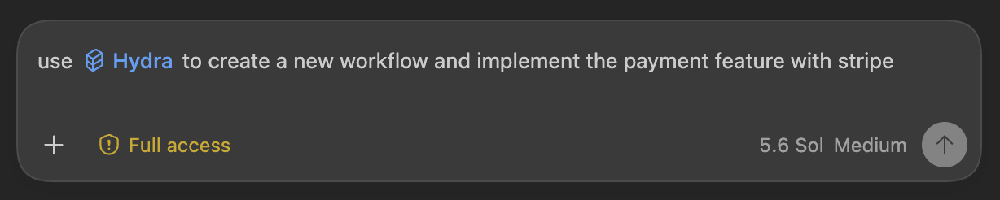

<h1 align="center">
  
</h1>

[](https://github.com/leonardoLoddo/hydra/actions/workflows/ci.yml)
[](LICENSE)

Hydra is a Git-native workspace manager for isolated development **Heads**.
Each Head has its own working tree, index, and private branch, so humans and AI
agents can work in parallel without sharing uncommitted files.

> [!IMPORTANT]
> Hydra is an early preview intended for a small group of testers. Use it on
> repositories whose important work is already committed or backed up, and
> report unexpected Git or filesystem state before attempting manual repair.

## Install

Install the Homebrew preview from the dedicated tap on macOS, native Linux, or
WSL 2:

```bash
brew install leonardoLoddo/tap/hydra-heads
```

The Formula is named `hydra-heads` because Homebrew already distributes an
unrelated package named `hydra`. The installed executable is still `hydra`.

To work from the repository instead, build from source with the pinned Rust
toolchain:

```bash
git clone https://github.com/leonardoLoddo/hydra.git
cd hydra
cargo install --path crates/hydra-cli --locked --force
```

Verify the executable you are using:

```bash
hydra --version
command -v hydra
```

## Quick start

Run these commands in an existing Git repository with at least one commit:

```bash
hydra init
hydra head create payment --from main --target main
hydra head path payment
hydra head status payment
```

Move your editor, terminal, or agent into the path printed by `head path`.
When the work is committed and ready to integrate, inspect it before running:

```bash
hydra head close payment
```

Use `hydra --help` and `hydra <command> --help` for the complete installed
syntax. The maintained [Italian user guide](Docs/user/hydra-user-guide.it.md)
contains the detailed workflows and safety constraints.

## Optional Codex skill

Hydra ships an optional Agent Skill that teaches Codex the safe Head workflow.
Homebrew never installs it silently. Install it explicitly and confirm the
default-negative prompt:

<p align="center">
  
</p>

```bash
hydra skill install codex
```

For unattended setup, make the choice explicit:

```bash
hydra skill install codex --yes
# or
hydra skill install codex --no
```

Manage only the copy installed by Hydra:

```bash
hydra skill status codex
hydra skill update codex
hydra skill remove codex
```

Hydra preserves an unknown or locally modified skill instead of overwriting or
deleting it. Codex normally detects skill changes automatically; restart Codex
only if `$hydra` does not appear or an update is not visible.

## Update and uninstall

```bash
brew update
brew upgrade leonardoLoddo/tap/hydra-heads
```

After upgrading the binary, check the independently managed skill:

```bash
hydra skill status codex
hydra skill update codex
```

Remove the binary and, only if desired, the skill:

```bash
hydra skill remove codex
brew uninstall leonardoLoddo/tap/hydra-heads
```

Homebrew uninstall does not remove user-owned skill content.

## Preview platforms

Release automation builds native archives for:

- macOS on Apple Silicon (`aarch64-apple-darwin`);
- macOS on Intel (`x86_64-apple-darwin`);
- Linux ARM64 (`aarch64-unknown-linux-gnu`);
- Linux x86-64 (`x86_64-unknown-linux-gnu`).

Release automation is configured to verify Homebrew installation on both
macOS and Linux architectures before updating the tap. WSL 2 uses the Linux
Formula and remains preview evidence to exercise directly with a colleague;
WSL 1 and native Windows are not supported.

The published `v0.1.0` Formula predates Linux URL metadata. Homebrew support on
Linux and WSL 2 therefore becomes available when the next patch release
regenerates the tap Formula.

The preview build baseline is macOS 11 or newer and Linux distributions with
glibc 2.35 or newer (including Ubuntu 22.04 or newer).

## Development

Hydra requires the repository-pinned Rust toolchain. Before proposing a change,
run:

```bash
cargo fmt --all --check
cargo check --workspace --all-targets
cargo clippy --workspace --all-targets -- -D warnings
cargo test --workspace
```

See [AGENTS.md](AGENTS.md) and the
[documentation router](Docs/hydra-context-router.md) for the project contracts,
TDD workflow, and safety invariants.

Bug reports and preview feedback are welcome through the repository's
[issue templates](https://github.com/leonardoLoddo/hydra/issues/new/choose).
Read [CONTRIBUTING.md](CONTRIBUTING.md) before proposing a change and report
security-sensitive defects through the private process in
[SECURITY.md](SECURITY.md).

## License

Copyright 2026 Leonardo Loddo. Licensed, at your option, under the
[MIT License](LICENSE-MIT) or [Apache License 2.0](LICENSE-APACHE).
