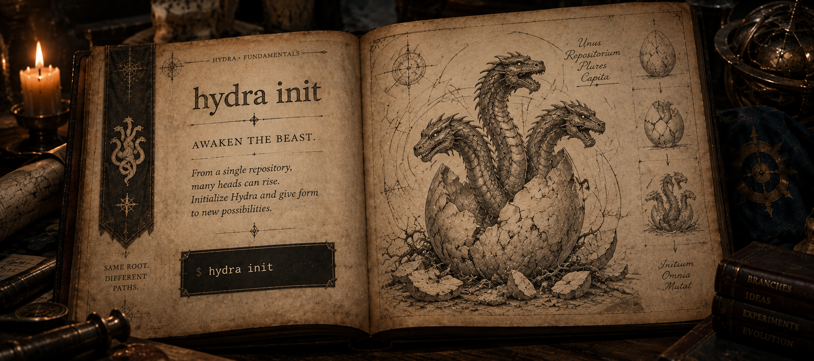
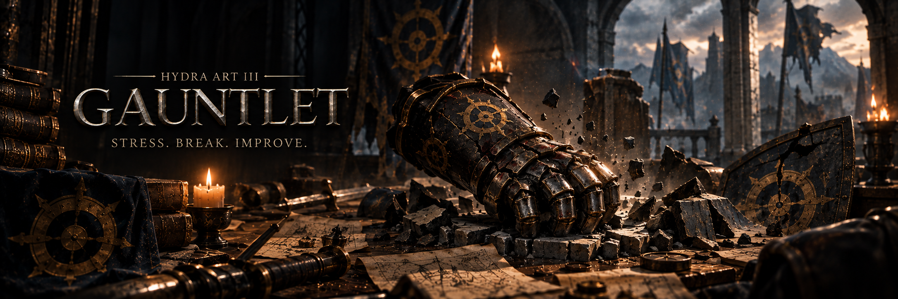
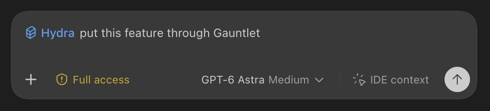

<h1 align="center">
  
</h1>

[](https://github.com/leonardoLoddo/hydra/actions/workflows/ci.yml)
[](LICENSE)

Hydra gives AI coding agents and humans isolated, disposable working realities
inside a Git project. Each **Head** has its own working tree, index, and private
branch, so parallel work, experiments, and validation do not share uncommitted
files.

> [!IMPORTANT]
> Hydra 1.x is the current SemVer compatibility line for the documented core.
> Distribution remains a public preview intended for a small group of testers
> while broader tester feedback continues. Use it on repositories whose
> important work is already committed or backed up, and report unexpected Git
> or filesystem state before attempting manual repair.

Version `1.0.0` establishes the compatibility baseline for Hydra's documented
CLI, configuration, persisted state, and Head lifecycle. Future incompatible
changes to those contracts require another major version. The preview label
describes the current breadth of real-world qualification; it does not make
published compatibility guarantees disposable. See the
[latest release](https://github.com/leonardoLoddo/hydra/releases/latest) and
[changelog](CHANGELOG.md).

## Install

Install the current public preview from the dedicated Homebrew tap on macOS,
native Linux, or WSL 2:

```bash
brew install leonardoLoddo/tap/hydra-heads
```

The Formula is named `hydra-heads` because Homebrew already distributes an
unrelated package named `hydra`. The installed executable is still `hydra`.
The Formula also installs dynamic Bash, Zsh, and Fish completions in Homebrew's
standard directories; manual activation remains documented for shells that do
not load them automatically.

On native Windows x86-64, use the stable release links:

[Download Hydra for Windows](https://github.com/leonardoLoddo/hydra/releases/latest/download/hydra-windows-x86_64.zip)
· [SHA-256 checksum](https://github.com/leonardoLoddo/hydra/releases/latest/download/hydra-windows-x86_64.zip.sha256)

Extract the archive into a directory on the Windows `PATH`, then use
`hydra.exe` from Git Bash. The ZIP includes `completions/hydra.bash`; because
the archive is portable, activate that script explicitly from `~/.bashrc` as
described in the installation guide. The stable links always resolve through
the latest GitHub Release; the same release also contains the versioned
Windows archive and all macOS and Linux artifacts. Native Windows packaging is
available in published releases
starting with `v0.2.0`. Homebrew remains the installation channel for macOS,
Linux, and WSL 2.

To work from the repository instead, build from source with the pinned Rust
toolchain:

```bash
git clone https://github.com/leonardoLoddo/hydra.git
cd hydra
cargo install --path crates/hydra-cli --locked --force
```

Verify the executable you are using:

```bash
hydra --version
command -v hydra
```

## Quick start

Hydra begins with a repository and a first commit.

From there, you can awaken the beast, grow an isolated Head, enter its workspace, and bring its work back when it is ready.

> Run the following commands inside an existing Git repository with at least one commit.

### I. Awaken the Hydra

<p align="center">
  
</p>

Every Hydra starts from a single repository.

```bash
hydra init
```

This prepares the repository for Hydra and establishes the root from which isolated Heads can grow.

---

### II. Grow a Head

<p align="center">
  
</p>

Create a Head for the work you want to isolate:

```bash
hydra head create payment --from main --target main
```

`--from main` defines where the Head begins.

`--target main` defines where its work will eventually return.

Each Head gets its own isolated workspace while remaining part of the same repository.

You can ask Hydra where that workspace lives:

```bash
hydra head path payment
```

Then move your editor, terminal, or coding agent into the printed path.

At any point, inspect the Head:

```bash
hydra head status payment
```

From there, work normally: edit files, run commands, test ideas, and commit the result inside the Head.

---

### III. Bring the Head Home

<p align="center">
  
</p>

When the implementation is committed and ready to return, go back to the parent project with the target branch checked out and close the Head:

```bash
hydra head close payment
```

Closing a Head brings its committed work back to its target branch.

Hydra performs an ordinary Git merge in the parent worktree and exposes Git's output directly.

If Git finds conflicts, resolve and commit them in the parent project while Hydra waits. Once reconciliation succeeds, Hydra resumes and safely removes the isolated Head.

If you decide the reconciliation should not continue:

```bash
git merge --abort
```

The close is aborted and the Head is preserved.

---

### IV. Sever a Head

<p align="center">
  
</p>

Not every Head is meant to return.

Experiments fail. Ideas change. Some paths are simply not worth keeping.

Ordinary removal succeeds only when the Head is clean and its commits are
already integrated into the recorded target:

```bash
hydra head remove payment
```

To deliberately discard uncommitted work or remove a Head whose commits are
not integrated, make that destructive choice explicit:

```bash
hydra head remove payment --force
```

Forced removal preserves an unintegrated private branch, but discards tracked,
staged, and untracked worktree changes. The parent project remains untouched.

---

### Teach your agents Hydra

<p align="center">
  
</p>

Hydra can teach supported AI coding agents how to use it autonomously:

```bash
hydra skill install <provider>
```

This installs the Hydra Skill for the selected provider, giving the agent the knowledge it needs to recognize when Hydra is useful and operate Heads as part of its normal workflow.

---

### Know your Hydra

For the complete installed syntax:

```bash
hydra --help
hydra <command> --help
```

Use these whenever you need to inspect available commands, options, or provider-specific behavior.

### Inspect Hydra from automation

Every read-only command that returns Hydra data supports a versioned JSON mode:

```bash
hydra status --json
hydra head list --json
hydra head status payment --json
hydra head path payment --json
hydra doctor storage --json
hydra skill status codex --json
```

Each success emits one JSON object with `"schemaVersion": 1`. Human output is
unchanged without the flag; inspection and validation failures remain non-zero
with empty stdout and an actionable diagnostic on stderr. Lifecycle mutations,
repair, and shell completion do not accept `--json`.

## Hydra Arts

<p align="center">
  
</p>

Hydra does more than create isolated workspaces. Its portable Agent Skill
teaches AI coding agents how to turn those disposable realities into adaptive
problem-solving strategies. The Arts are intent-driven, not rigid pipelines:
use the lightest execution that preserves their purpose and skip work that does
not improve the result.

### Arena — Competitive Implementation

<p align="center">
  
</p>

> **Let the heads compete. Crown the strongest.**

When several materially different implementations are credible, build them in
independent Heads from the same baseline and choose from actual results instead
of theory. Arena adapts the number of contenders to the real alternatives,
compares them against the task's important criteria, and salvages useful tests
or discoveries from losing Heads before cleanup.

### Augury — Experimental Design

<p align="center">
  
</p>

> **Walk the future. Return with knowledge.**

When a feature or architecture contains assumptions that discussion cannot
settle cheaply, build only enough of it in a disposable Head to inspect, run,
and challenge the idea. Augury optimizes for information gained, stops as soon
as the decision is clear, and carries evidence forward rather than promoting a
prototype by inertia.

### Gauntlet — Adversarial Validation

<p align="center">
  
</p>

> **Make the implementation earn its survival.**

Green tests are a starting point, not a coronation. Gauntlet attacks an
existing implementation in an isolated Head using the most relevant ideas from
mutation testing, property-based testing, fuzzing, fault injection, stress
testing, and simplification review. It prefers reproducible failures and brings
back proof artifacts such as regression tests or benchmarks without damaging
the working branch.

Invoke an Art directly (`Use Arena`, `Run Augury`, `Put this through
Gauntlet`), let an agent suggest one when the value is plausible, or allow the
skill to select one when the benefit clearly justifies the cost. Arts can
compose, but they are never ceremonial steps or a mandatory lifecycle.

## Documentation

The complete [English user guide](Docs/user/hydra-user-guide.md) explains the
concepts, installation, Head lifecycle, configuration, storage and overlays,
Agent Skills, recovery, troubleshooting, and current CLI.

Focused pages:

- [Installation and updates](Docs/user/installation.md)
- [Core concepts](Docs/user/concepts.md)
- [Head workflows](Docs/user/head-workflows.md)
- [Configuration](Docs/user/configuration.md)
- [Storage and overlays](Docs/user/storage-and-overlays.md)
- [Windows copy-on-write setup](Docs/user/windows-copy-on-write.md)
- [WSL 2 copy-on-write setup](Docs/user/wsl-copy-on-write.md)
- [Agent Skills](Docs/user/agent-skills.md)
- [Recovery and troubleshooting](Docs/user/recovery-and-troubleshooting.md)
- [CLI reference](Docs/user/cli-reference.md)

The complete [Italian user guide](Docs/user/hydra-user-guide.it.md) is
maintained alongside the English documentation.

## Optional Agent Skill

Hydra ships one portable Agent Skill that teaches supported AI agents the safe
Head workflow and the Hydra Arts. Homebrew never installs it silently. Choose
the provider whose personal skill directory you want Hydra to manage:

<p align="center">
  
</p>

```bash
hydra skill install codex
hydra skill install gemini
hydra skill install agy
hydra skill install antigravity
```

<p align="center">
  
</p>

For unattended setup, make the choice explicit:

```bash
hydra skill install codex --yes
# or
hydra skill install codex --no
```

Manage only the copy installed by Hydra:

```bash
hydra skill status codex
hydra skill update codex
hydra skill remove codex

hydra skill status gemini
hydra skill update gemini
hydra skill remove gemini

hydra skill status agy
hydra skill update agy
hydra skill remove agy

hydra skill status antigravity
hydra skill update antigravity
hydra skill remove antigravity
```

Hydra preserves an unknown or locally modified skill instead of overwriting or
deleting it. Codex normally detects changes automatically. Gemini CLI can
rescan its skill directories with `/skills reload`. In Antigravity CLI, restart
the host if needed and use `/skills` to inspect discovery. In the Antigravity
app, restart if needed and check **Settings > Customizations > Skills**.

Gemini CLI also recognizes `$HOME/.agents/skills`, so it may discover the copy
installed for Codex without a second installation. Use `gemini` when you want
an independently managed copy in Gemini's native personal directory. AGY and
the Antigravity app use separate global locations.

## Update and uninstall

```bash
brew update
brew upgrade leonardoLoddo/tap/hydra-heads
```

After upgrading the binary, check each independently managed provider copy:

```bash
hydra skill status codex
hydra skill update codex
hydra skill status gemini
hydra skill update gemini
hydra skill status agy
hydra skill update agy
hydra skill status antigravity
hydra skill update antigravity
```

When upgrading from `0.2.x`, note the `1.0.0` breaking change: run
`hydra head close` from the canonical parent project with the recorded target
branch checked out. Git merges and any conflict resolution now happen in that
parent worktree.

Remove the binary and, only if desired, the skill:

```bash
hydra skill remove codex
hydra skill remove gemini
hydra skill remove agy
hydra skill remove antigravity
brew uninstall leonardoLoddo/tap/hydra-heads
```

Homebrew uninstall does not remove user-owned skill content.

## Supported preview platforms

Release automation builds native archives for:

- macOS on Apple Silicon (`aarch64-apple-darwin`);
- macOS on Intel (`x86_64-apple-darwin`);
- Linux ARM64 (`aarch64-unknown-linux-gnu`);
- Linux x86-64 (`x86_64-unknown-linux-gnu`);
- Windows x86-64 (`x86_64-pc-windows-msvc`).

Release automation is configured to verify Homebrew installation on both
macOS and Linux architectures before updating the tap. WSL 2 uses the Linux
Formula and has been exercised directly during preview validation; native
Windows has been exercised on Windows 11 with Git for Windows and Git Bash.
Windows artifacts are published as both a versioned ZIP and the stable
`hydra-windows-x86_64.zip` download. WSL 1 is not supported.

The current Formula includes native archive metadata for Linux. WSL 2 uses
that Linux Formula; its end-to-end Homebrew workflow has been directly
exercised during preview validation.

The preview build baseline is macOS 11 or newer, Linux distributions with
glibc 2.35 or newer (including Ubuntu 22.04 or newer), and Windows 11 x86-64.
On Windows, ReFS can provide block-clone COW while unsupported volumes safely
fall back to full copies; tracked and overlay symlinks remain unsupported.

## Development

Hydra requires the repository-pinned Rust toolchain. Before proposing a change,
run:

```bash
cargo fmt --all --check
cargo check --workspace --all-targets
cargo clippy --workspace --all-targets -- -D warnings
cargo test --workspace
```

See [AGENTS.md](AGENTS.md) and the
[LibrAIrian project knowledge router](Docs/ai/ROUTER.md) for the project
contracts, TDD workflow, and safety invariants. Hydra uses
[LibrAIrian Protocol](https://github.com/leonardoLoddo/librairian) to route the
smallest complete set of repository-local knowledge required by an AI agent.

Bug reports and preview feedback are welcome through the repository's
[issue templates](https://github.com/leonardoLoddo/hydra/issues/new/choose).
Read [CONTRIBUTING.md](CONTRIBUTING.md) before proposing a change and report
security-sensitive defects through the private process in
[SECURITY.md](SECURITY.md).

## License

Copyright 2026 Leonardo Loddo. Licensed, at your option, under the
[MIT License](LICENSE-MIT) or [Apache License 2.0](LICENSE-APACHE).
